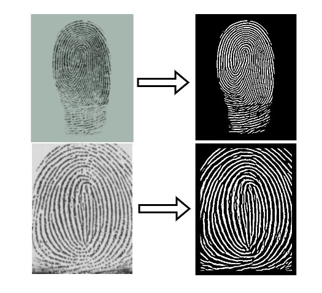

# Fingerprint matching systems and Sensor Interoperability problem

This repository contains code for our project on Fingerprint Enhancement using Generative Adversarial Networks. SWe make use of latent representations to enhance fingerpreint images, which can then be used for verification and aunthentication purposes. 
## Output Images

## Running the tests

